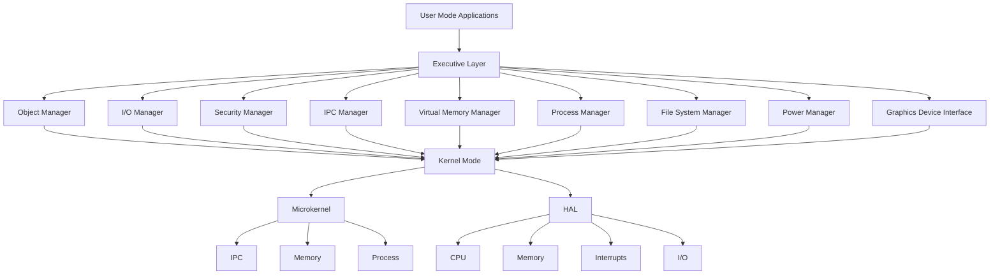

# Executive Layer Architecture Design

## Overview

The Executive Layer sits between the Kernel Mode and User Mode layers in the GamerOS architecture. It provides higher-level services that build upon the low-level Kernel Mode APIs, offering abstracted interfaces for system management, I/O operations, graphics, and security.

## Architecture Components

### 1. Object Manager
### Architecture Diagram



**Purpose**: Manages system objects such as processes, threads, memory segments, files, and other kernel objects. Provides a unified interface for creating, tracking, and destroying system objects.

**Responsibilities**:
- Object creation and destruction
- Object reference counting
- Object security descriptors
- Namespace management
- Object handle allocation

**Key Interfaces**:
- `object_create(type, attributes)` - Create a new object
- `object_destroy(handle)` - Destroy an object
- `object_reference(handle)` - Increment reference count
- `object_dereference(handle)` - Decrement reference count

**Dependencies**: Uses Kernel Mode memory management and IPC for object storage and communication.

### 2. Executive Services

#### I/O Manager

**Purpose**: Manages input/output operations and device drivers. Provides abstracted access to hardware devices.

**Components**:
- Device driver management
- I/O request queuing
- Interrupt handling coordination
- Device object management

**Key Interfaces**:
- `io_register_driver(driver)` - Register a device driver
- `io_read(device, buffer, size)` - Read from device
- `io_write(device, buffer, size)` - Write to device
- `io_ioctl(device, command, args)` - Device-specific operations

**Refactoring from Current Code**:
- Move `keyboard.c`, `mouse.c`, `rtc.c` from `src/impl/drivers/` to I/O Manager
- Abstract hardware-specific code into driver interfaces
- Implement I/O request queuing system

#### Security Manager

**Purpose**: Manages security policies, access control, and user authentication.

**Components**:
- Access control lists (ACLs)
- Security tokens
- Privilege checking
- Audit logging

**Key Interfaces**:
- `security_check_access(object, operation, token)` - Check access permissions
- `security_create_token(user, privileges)` - Create security token
- `security_audit_log(event)` - Log security events

**Dependencies**: Uses Object Manager for security descriptors.

#### IPC Manager

**Purpose**: Provides higher-level interprocess communication services beyond the microkernel IPC.

**Components**:
- Named pipes
- Shared memory regions
- Message queues
- Synchronization primitives

**Key Interfaces**:
- `ipc_create_channel(name)` - Create named IPC channel
- `ipc_send(channel, message)` - Send message
- `ipc_receive(channel)` - Receive message
- `ipc_create_shared_memory(name, size)` - Create shared memory region

**Dependencies**: Builds on Kernel Mode IPC primitives.

#### Virtual Memory Manager (VMM)

**Purpose**: Advanced memory management including virtual address spaces, paging policies, and memory protection.

**Components**:
- Address space management
- Page fault handling
- Memory mapping
- Working set management

**Key Interfaces**:
- `vmm_allocate_address_space()` - Create new address space
- `vmm_map_memory(virtual_addr, physical_addr, size, flags)` - Map memory
- `vmm_unmap_memory(virtual_addr, size)` - Unmap memory
- `vmm_protect_memory(virtual_addr, size, protection)` - Set memory protection

**Dependencies**: Extends Kernel Mode memory management.

#### Process Manager

**Purpose**: Higher-level process management including scheduling policies and process groups.

**Components**:
- Process creation/destruction
- Thread management
- Scheduling coordination
- Process synchronization

**Key Interfaces**:
- `process_create(image, args)` - Create new process
- `process_terminate(pid)` - Terminate process
- `thread_create(process, entry_point)` - Create thread
- `process_wait(pid)` - Wait for process completion

**Dependencies**: Uses Kernel Mode process management.

#### File System Manager

**Purpose**: File system operations and management.

**Components**:
- File system drivers
- Directory management
- File caching
- Volume management

**Key Interfaces**:
- `fs_mount(volume, mount_point)` - Mount file system
- `fs_open(path, mode)` - Open file
- `fs_read(file, buffer, size)` - Read from file
- `fs_write(file, buffer, size)` - Write to file
- `fs_create_directory(path)` - Create directory

**Refactoring from Current Code**:
- Move `fs.c` from `src/impl/filesystem/` to File System Manager
- Extend basic file operations with caching and advanced features
- Implement file system driver interface

#### Power Manager

**Purpose**: Manages power-related operations including sleep states and power policies.

**Components**:
- Power state transitions
- Device power management
- Battery monitoring
- Power policies

**Key Interfaces**:
- `power_set_state(state)` - Set system power state
- `power_register_device(device)` - Register device for power management
- `power_get_battery_status()` - Get battery information

#### Graphics Device Interface (GDI)

**Purpose**: Provides high-level graphics operations and windowing system support.

**Components**:
- Graphics context management
- Drawing primitives
- Font rendering
- Image processing

**Key Interfaces**:
- `gdi_create_context(device)` - Create graphics context
- `gdi_draw_line(context, x1, y1, x2, y2)` - Draw line
- `gdi_draw_text(context, x, y, text)` - Draw text
- `gdi_blit_image(context, image, dest_x, dest_y)` - Blit image

**Refactoring from Current Code**:
- Move `vga_graphics.c` from `src/impl/graphics/` to GDI
- Abstract VGA-specific code into device drivers
- Implement higher-level graphics APIs
- Integrate with UI system for window management

## Directory Structure

```
src/executive/
├── object_manager/
│   ├── object_manager.c
│   ├── object_manager.h
│   └── object_types.h
├── io_manager/
│   ├── io_manager.c
│   ├── io_manager.h
│   ├── drivers/
│   │   ├── keyboard_driver.c
│   │   ├── mouse_driver.c
│   │   └── rtc_driver.c
│   └── io_request_queue.c
├── security_manager/
│   ├── security_manager.c
│   ├── security_manager.h
│   ├── access_control.c
│   └── audit_log.c
├── ipc_manager/
│   ├── ipc_manager.c
│   ├── ipc_manager.h
│   ├── named_pipes.c
│   └── shared_memory.c
├── vmm/
│   ├── vmm.c
│   ├── vmm.h
│   ├── address_space.c
│   └── page_fault_handler.c
├── process_manager/
│   ├── process_manager.c
│   ├── process_manager.h
│   ├── scheduler.c
│   └── thread_manager.c
├── filesystem_manager/
│   ├── filesystem_manager.c
│   ├── filesystem_manager.h
│   ├── fs_cache.c
│   └── volume_manager.c
├── power_manager/
│   ├── power_manager.c
│   ├── power_manager.h
│   └── device_power.c
└── gdi/
    ├── gdi.c
    ├── gdi.h
    ├── graphics_context.c
    ├── drawing_primitives.c
    ├── font_renderer.c
    └── image_processor.c
```

## Dependencies and Layering

```
User Mode Applications
         |
         v
Executive Layer Services
- Object Manager
- I/O Manager
- Security Manager
- IPC Manager
- VMM
- Process Manager
- File System Manager
- Power Manager
- GDI
         |
         v
Kernel Mode
- Microkernel (IPC, Memory, Process)
- HAL (CPU, Memory, Interrupts, I/O)
```

## Implementation Plan

1. **Phase 1**: Create Executive Layer skeleton with basic interfaces
2. **Phase 2**: Implement Object Manager as foundation
3. **Phase 3**: Refactor existing code into appropriate managers
4. **Phase 4**: Implement remaining services (Security, Power, etc.)
5. **Phase 5**: Integration testing and User Mode API development

## Key Design Principles

- **Abstraction**: Hide Kernel Mode complexity from User Mode
- **Modularity**: Each service is independent with clear interfaces
- **Extensibility**: Easy to add new drivers and services
- **Security**: All operations go through security checks
- **Performance**: Minimize overhead while providing rich functionality

## Next Steps

This design provides a clear roadmap for implementing the Executive Layer. The next step is to begin implementation starting with the Object Manager and I/O Manager, then proceed with refactoring existing code.